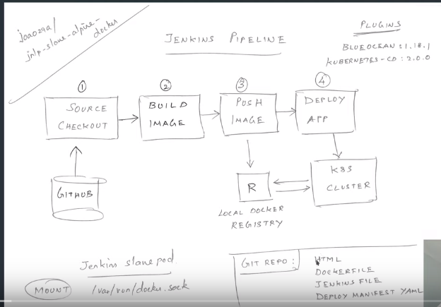

# playjenkins

### Jenkins pipeline ci/cd with (kubernetes) (jenkins master hors du cluster k8s et des slave qui se lance depuis le pipeline sur le cluster k8S et qui font le build ) (docker image registry) (blueocean 1.18.1 plugin de pipeline en mode graphique,kubernetes cd 2.0.0)
N.B: l'image jenkins qu'il faut utilisé dois contenir docker_binary


## installation jenkins avec helm
```
helm inspect values stable/jenkins > /tmp/jenkins.values
```
### changé manuellement la config sur le fichier jenkins.values
==> configure pass
```
  adminPassword: "rootroot"
  ```
==> configure memory/cpu selon la performence du cluster

```
    limits:
      cpu: "1000m"
      memory: "2096Mi"
```
==> configure service NodePort
```
  serviceType: NodePort
  nodePort: 32323
```
==> add plugins blueocean:1.18.1 (pipeline en mode graphique) et kubernetes-cd:2.0.0 (pour le deploy sur k8S)
```
  installPlugins:
    - kubernetes:1.24.1
    - workflow-job:2.36
    - workflow-aggregator:2.6
    - credentials-binding:1.21
    - git:4.2.0
    - blueocean:1.18.1
    - kubernetes-cd:2.0.0
 ```
==> configure image pour l'agent jenkins
```
agent:
  enabled: true
  image: "joao29a/jnlp-slave-alpine-docker"
  tag: "latest"
```
==> configure volume HostPath
```
  volumes:
  # - type: Secret
  #   secretName: mysecret
  #   mountPath: /var/myapp/mysecret
  # - type: EmptyDir
  #   mountPath: "/var/lib/containers"
  #   memory: false
    - type: HostPath
      hostPath: /var/run/docker.sock
      mountPath: /var/run/docker.sock
```
### changé les droits docker.sock sur les workers nodes 
```
chmod 666 /var/run/docker.sock
systemctl reload docker
```
## installation simple via un fichier de values déja parammetré (enregistrer sur ce repo)

```
git clone https://github.com/soufianem370/playjenkins.git
cd playjenkins
helm install jenkins stable/jenkins --values jenkins.values --namespace jenkins
```
## installer un local image registry docker

```
docker run -d -p 5000:5000 --restart=always --name registry -v docker:/var/lib/registry registry:2
```
sur chaque worker il faut ajouter une configuration pour ignorer les erreurs SSL
```
vi /etc/docker/daemon.json
```
inserer ce code

```
{
 "insecure-registries": ["172.17.0.1:5000"]
}
```
nb: @ip et le port de votre serveur image registry
